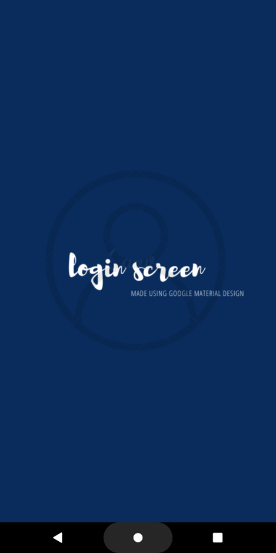
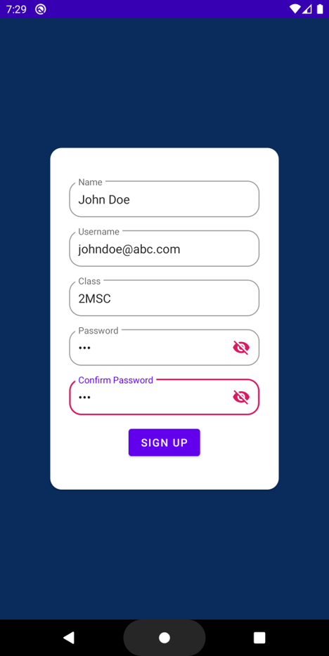
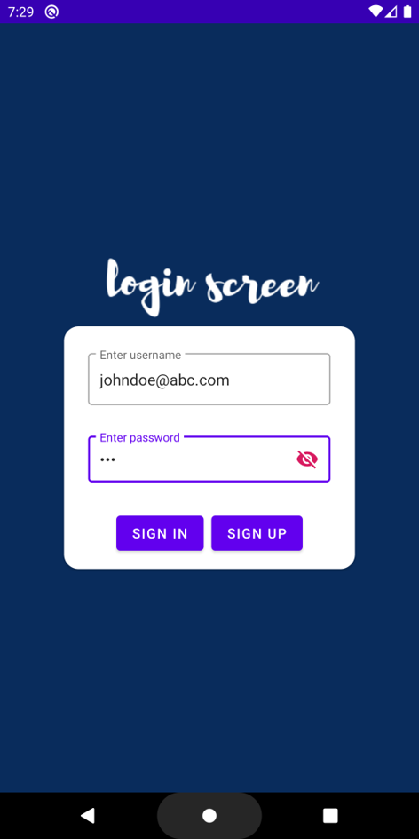
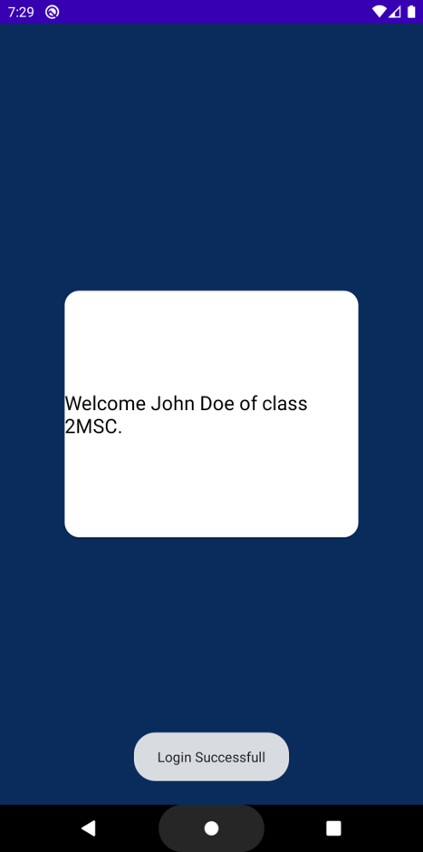

# Login-Screen
A simple user login mobile application made using Google's Material Design. The app also has a registration page where user can give the 
details. The user information will be saved using shared preference. 

The user details will be stored in a .xml file. To view the shared preference .xml file,
press cntrl + shift + A, a search box will appear,

search for 'Device File Explorer',

Go to data -> data -> project package name -> shared prefs -> .xml .

# Screenshots
                           

# Credits
[Google's Material Design](https://material.io/design/)

[Canva](https://www.canva.com/) - Canva is used for creating the Splashscreen image as well as the logo.
